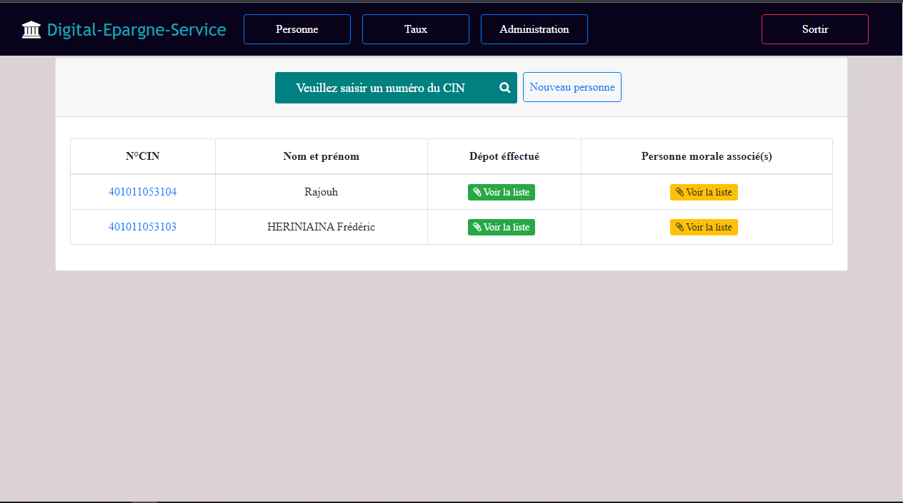

<h1 style="text-align: center;">Epargne </h1>

<h3 style="margin-left: 10px;">Gestion du service epargne : dépot du caisse et  retrait</h3>

<h3 style="margin-left: 10px;">Fonctionnalité: </h3>

<ul style="margin-left: 20px;">
  <li>Ajout du nouveau personne client : personne physique ou personne morale (association ou entreprise)</li>
  <li>Ajout du nouveau depot avec durée de 1 , 2  ou 3 ans : calcul automatique des capitaux et le durée de fin du contrat</li>
  <li>Impression du contrat , retrait du depot</li>
</ul>

<h3 style="margin-left: 10px;">Installation: </h3>

<ul style="margin-left: 20px;">
  <li>git clone https://github.com/djessa/epargne.git</li>
  <li>cd epargne</li>
  <li>git checkout master</li>
  <li>composer install</li>
  <li>yarn install</li>
  <li>configuration de base de données dans le fichier .env</li>
  <li>php bin/console doctrine:database:create</li>
  <li>php bin/console doctrine:migrations:migrate</li>
</ul>

    

